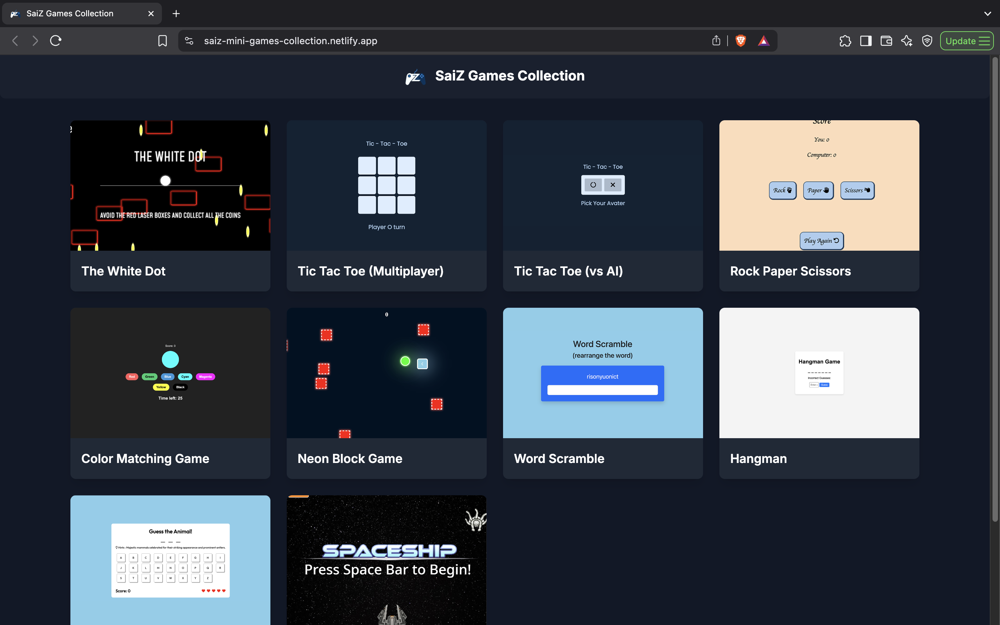
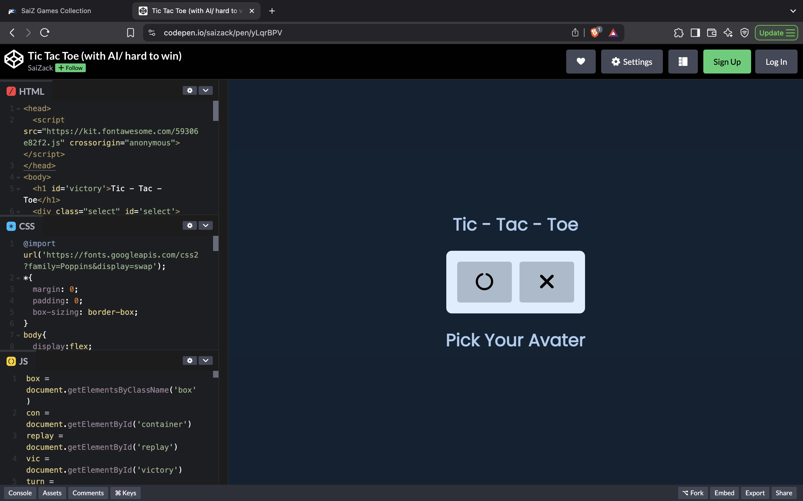
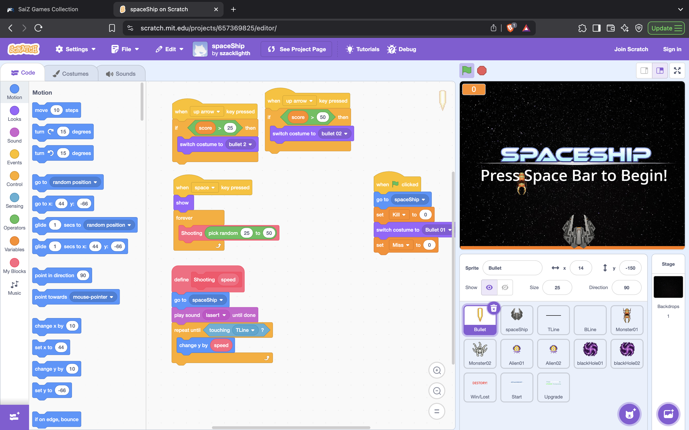

# 🎮 SaiZ Games Collection

Welcome to **SaiZ Games Collection**, a fun and interactive hub of mini-games developed using **HTML, CSS, JavaScript**, and **Scratch**! Each game is simple to play, visually clean, and great for both entertainment and educational inspiration.

🌐 Live Site: [saiz-mini-games-collection.netlify.app](https://saiz-mini-games-collection.netlify.app)

---

## 🕹️ Featured Games

| Game Title               | Description                                           | Technology       |
|--------------------------|-------------------------------------------------------|------------------|
| **The White Dot**        | Dodge red laser boxes and collect all the coins!     | HTML/CSS/JS      |
| **Tic Tac Toe (Multiplayer)** | Play classic Tic Tac Toe with a friend.             | HTML/CSS/JS      |
| **Tic Tac Toe (vs AI)**  | Play against a challenging AI opponent.              | HTML/CSS/JS      |
| **Rock Paper Scissors**  | Classic hand game in a digital format.               | HTML/CSS/JS      |
| **Color Matching Game**  | Match colors under time pressure.                    | HTML/CSS/JS      |
| **Neon Block Game**      | Dodge neon obstacles and survive.                    | HTML/CSS/JS      |
| **Word Scramble**        | Rearrange letters to form words.                     | HTML/CSS/JS      |
| **Hangman**              | Guess the hidden word before it's too late.          | HTML/CSS/JS      |
| **Animal Guessing Game** | Guess the animal name based on hints.                | HTML/CSS/JS      |
| **Spaceship Game**       | Scratch project: Navigate a spaceship, shoot enemies.| Scratch          |

---

## 🧠 Source Code Access

Most of the games are hosted on **CodePen**, making it easy to view and fork the full source code:

👉 [Explore on CodePen](https://codepen.io/saizack)

Some games like **Spaceship** are developed using **Scratch**, and you can also view their block-based code:

👉 [View Scratch Projects](https://scratch.mit.edu/users/szacklighth/)

---

## 🛠 Tech Stack

- **Frontend**: HTML, CSS (Tailwind), Vanilla JavaScript
- **Game Hosting**: CodePen, Scratch
- **Deployment**: Netlify
- **Design Fonts**: Inter, Poppins
- **Icons**: FontAwesome

---

## 📁 Project Structure

The main website is a static page listing all the games with images and links to external sources:

- `/index.html` – Home page with game links
- `/image/` – Folder containing cover images for each game
- Tailwind CSS is used directly via CDN for styling

---

## 📸 Screenshots

| Main Site | Codepen Source Code | Scratch Source Code |
|-----------|----------------|-------------------|
|  |  |  |

---

## ✨ Author

**Sai Zack**  
GitHub: [@sai-zack-dev](https://github.com/sai-zack-dev)  
Codepen: [saizack](https://codepen.io/saizack)  
Scratch: [szacklighth](https://scratch.mit.edu/users/szacklighth/)

---

## 📜 License

This project is for personal use, learning, and fun. Feel free to explore and learn from the code, but please give credit if you share or modify it.

---

